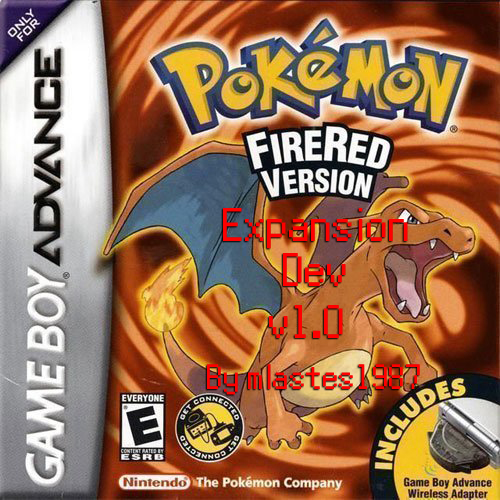

# Pokémon FireRed and LeafGreen Expansion Dev

Based on the pokefirered disassembly with Pokeemerald Expansion Updates from [**cawtds**](https://github.com/cawtds/pokefirered)

# Features

- **Reusable TMs**

- **Forgettable HMs** Without a Move Tutor.

- **HGSS Pokedex Plus** Backported from HeartGold Soul Silver, you get to enjoy the features of Pokedex Plus.

- **Trade Evolutions** All Trade Evolutions can evolve by using either a Link Cable or their specific evolution items like Metal Coat or King's Rock, but can also evolve by trading between the FR and LG out of the box.

- **Debug Menu** By pressing R+Start you can open a special debug menu made by a few people. [**see here**](/include/config/debug.h)

- **Double Battles** All double battles no longer require you to have two pokemon in your party.

- **Gen 5 Map Area Popups** All Map Area Popups are switched to Gen 5 and include a 12hr clock displayed at the bottom.

- **Gen 6 Exp. Share** From the beginning, you can enable the Gen 6 Exp. Share flag 0x4A7 from the Debug menu to share Experience points with your party.

More features coming soon...
